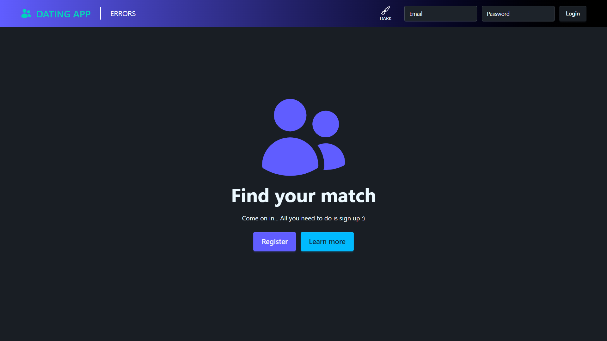
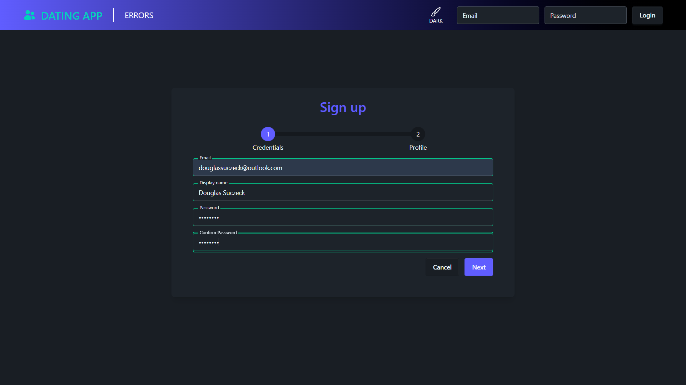
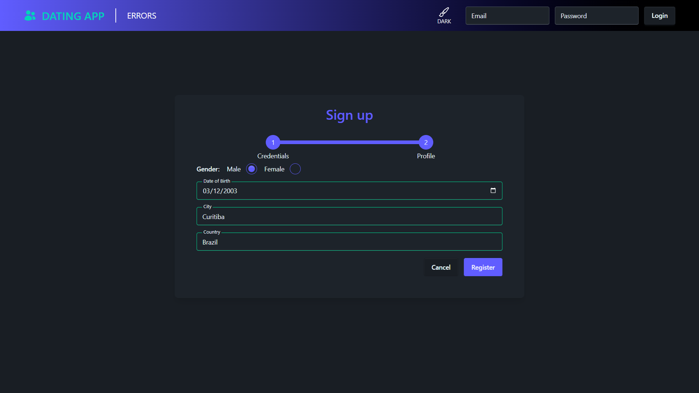
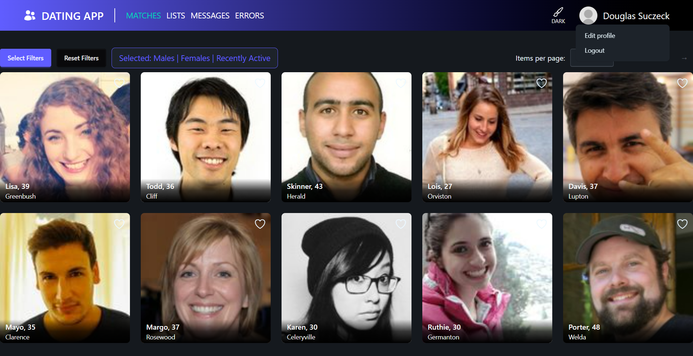
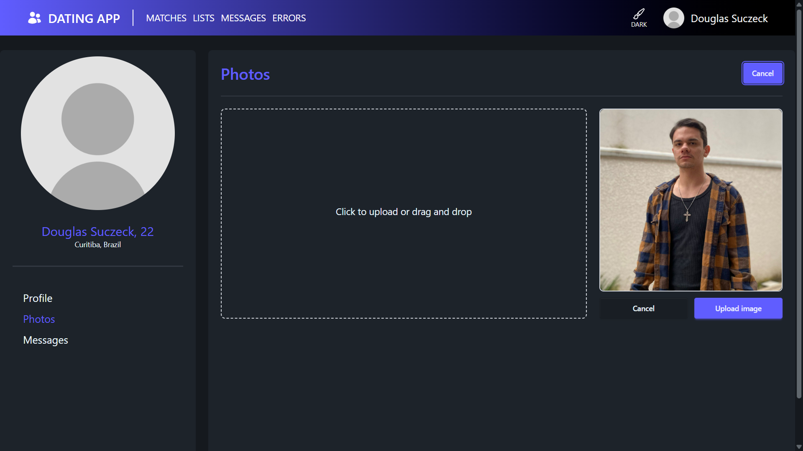
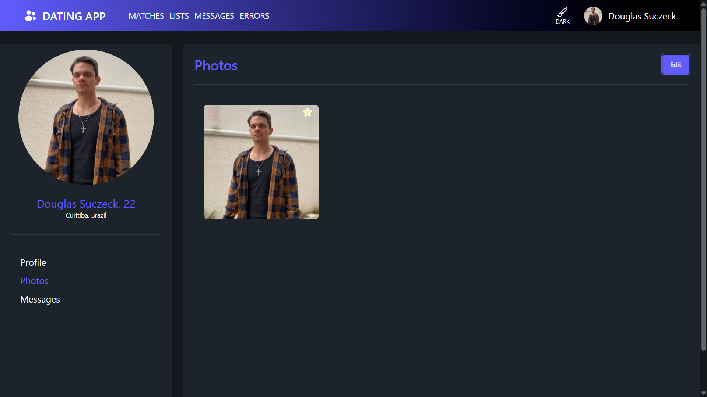
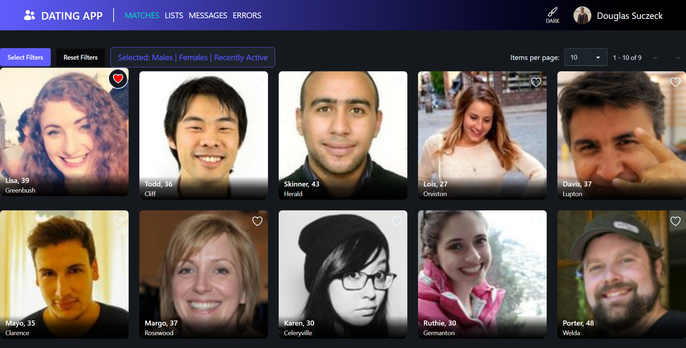
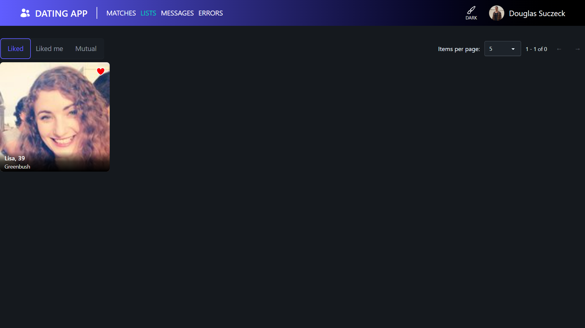

# 💘 Dating App – Full Stack Project (Angular + .NET)

A full-stack dating application built with Angular (frontend) and .NET (backend).
This project was created as a portfolio piece to demonstrate real-world application architecture, authentication, file uploads, and business logic implementation.

## 🚀 Features

- User registration and authentication (JWT)
- Profile creation and editing
- Photo upload
- Like system
- Match detection
- Real-time messaging (if you implement it later)

## 🔐 Authentication Flow

1. User logs in with email and password.
2. Backend validates credentials.
3. A JWT token is generated.
4. Angular stores the token.
5. HTTP Interceptor attaches the token to protected requests.

## ⚙️ Running the Project

### Backend
1. Navigate to the API folder
2. Run:
   dotnet run

### Frontend
1. Navigate to the client folder
2. Run:
   2.1: npm install
   2.2: ng serve

## 📝 Register
1. On the home page, click on the register button:

2. Now you need to input your credentials: email, display name, password, confirm password and then click Next:

3. Now set your profile information, like date of birth and location (remember you need to be over 18), and then click Register:

## 👤 Setting your profile

1. Now that you are already a user, click on your profile photo at the right top corner and then click on Edit profile:

2. On your profile page, click on Edit to upload a new image, you can drag a new image from anywhere, and then you'll se the following screen, where you can click the Upload image button:

3. Now you'll have a new photo on your profile, and as this photo is the first photo on the profile, it's automatically set as the profile photo as well, like this:

You can add how many images you want, using the Edit button.

## 💘 Matching

1. Now that you have a good profile, go back to the matches page and find a good profile that you like, you can like that profile with the heart icon:

In this example, I liked Lisa's profile, so her heart icon turned red. I can click the heart icon again and undo this action.

2. You can go to the lists page and find the users you've liked so far, as well as users who have liked you:

## ⚠️ Important observations:

1. This application is still in middle development
2. A future feature of messaging is currently in development
3. This application will be published once it's 100% complete
4. When published, it will have a Brazilian Portuguese version as well
